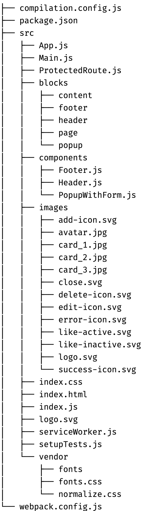
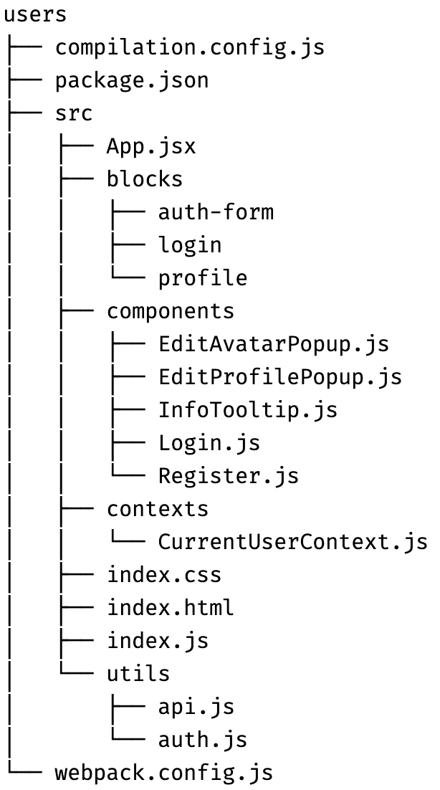
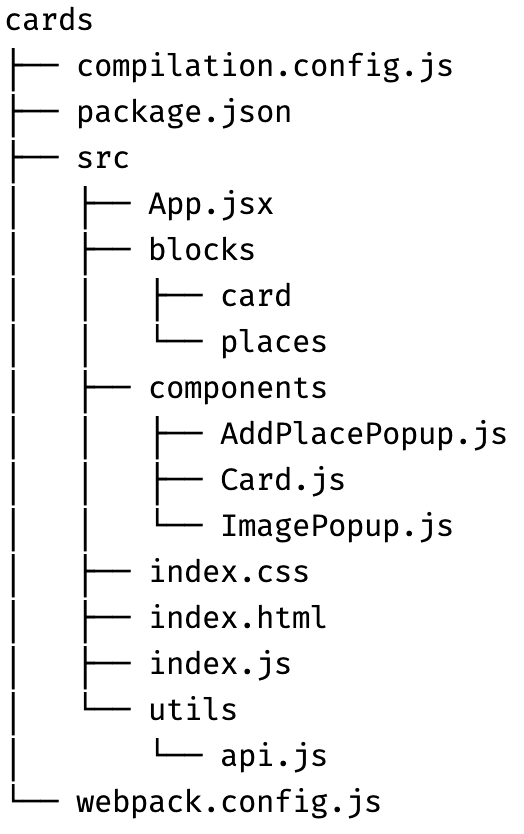

# Задание 1. Разделение на микрофронтенды

## Уровень 1. Проектирование

### 1. Предварительный анализ
После ознакомления с проектом, при помощи вертикальной нарезки и изоляции, разделил монолитный фронент на 2 среза:
- Пользователи(users)
- Карточки(cards)

### 2. Определение бизнес функций(домены)
Определил какие бизнес-функции будут относиться к каждому домену.
#### Функции микрофронтенда пользователей:
- Логин
- Регистрация
- Обновление профиля

#### Функции мирофронтенда карточки:
- Список карточек
- Загрузка новых карточек
- Лайк карточки

### 3. Метод реализации
Между Build Time и Run time, выбрал **Run Time**, в пользу высокой гибкости, независимого развертывания и частых обновлений.
По композиции, между серверной, клиентской и гибридной, для данного проекта выбрал **клиентскую**.
Где браузер будет отвечать за динамическую загрузку каждого микрофронтенда во время выполнения.

### 4. Инструмент для создания микрофронтенда

**Фреймворк - Webpack Module Federation**

**Выбрал Module Federation, основываясь на следующих поинтах.**

1. В Single SPA загрузка каждого микрофронтенда происходит по определенному маршруту(activeWhen), что в нашем случае не совсем подходит. На главной
странице, то есть по одной ссылке, отображается сразу несколько UI элементов(отображение/редактирование профиля, список карточек, и т.д.), при использовании Single SPA 
в этом случае, все компоненты окажутся в одном микрофронтенде, в то время как в Module Federation, позволит подгрузить множество независимых микрофронтендов по одному пути.

2. Ключевая особенность Single SPA от Module Federation, это возможность использовать разные фреймворки(Framework Agnostic).
По моему мнению, использование разных флейворков для сервиса Mesto, не совсем релевантно,
в интерфейсе не так много сложного функционала для которого потребуются разные специализированные фрейморвки.

### 5. Межмодульное взаимодействие
Между различными стратегиями по управлению состоянием и коммуникацией между микрофронтендами,
выбрал - **библиотеку глобального состояния**. Для того чтобы поддерживать последовательный
пользовательский опыт и хранить общее состояние которое может использоваться между различными микрофронтендами.

## Уровень 2. Планирование изменений
Внес изменения в проект согласно первому уровню. При использовании Module Federation, нужно создать основное приложение(хост) и удаленные модули.
Создал host приложение, которое будет основным и подгружать нужные компоненты в зависимости от запроса. Так же создал два микрофронтенда - users и cards. Распределил все компоненты монолитного приложения между host, users и cards.

#### Стукрутура хост приложения 

#### Стукрутура users приложения

#### Стукрутура cards приложения

# Задание 2. Декомпозирование веб-приложения

> Внес изменение в схему согласно ревью

Не до конца было понятно задание, постарался потоки данных между сервисами. Так же хочу подстветить 2 нюанса
1. Так и не смог покрасить стрелочки и сервисы в красный цвет. Draw.io мне не дался :)
2. Не уверен, что правильно шарю, поэтому добавил ссылку на draw.io и на саму диаграмму

Ссылка на draw.io - https://app.diagrams.net/#G13eP88pulyzH0O4xQRMlzWFA71RZL2mYd#%7B%22pageId%22%3A%22fjTxGfFFKktdyyrigxll%22%7D

Cсылка на диаграмму - https://drive.google.com/file/d/13eP88pulyzH0O4xQRMlzWFA71RZL2mYd/view?usp=share_link
